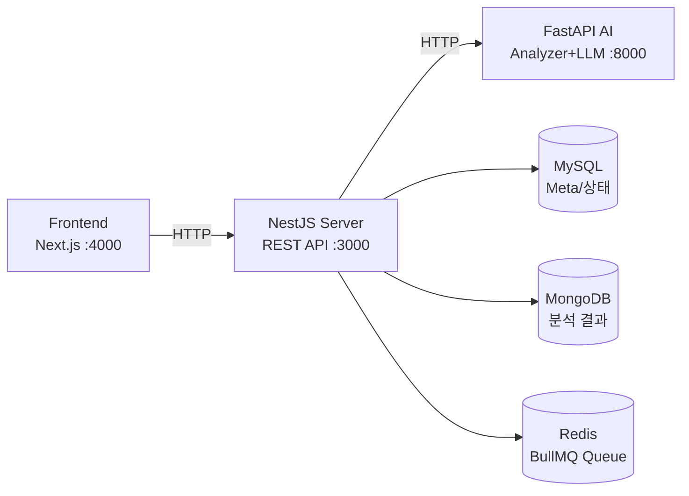
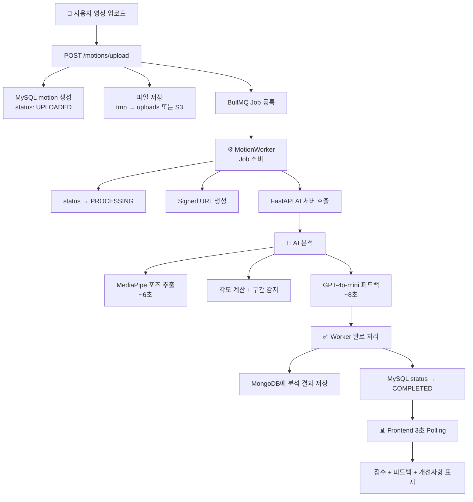

# MotionLab Server

> AI 기반 스포츠 동작 분석 플랫폼 — 백엔드 API 서버

---

## 📖 Overview

MotionLab은 사용자가 운동 영상을 업로드하면 AI가 자세를 분석하고
개선 피드백을 제공하는 플랫폼입니다.

**핵심 기능**:

- 🎥 운동 영상 업로드 및 비동기 분석 (BullMQ Worker)
- 🤖 AI 분석 서버 연동 (FastAPI HTTP 호출)
- 📊 종합 점수, 각도 분석, 개선사항 피드백 저장/조회
- 🏌️ 7개 종목 지원 (Golf 4 + Weight 3)
- 🔐 JWT 인증 (Access Token + Refresh Token)
- 📁 로컬/S3 스토리지 자동 전환

---

## 🏗️ System Architecture



---

## 🔄 Analysis Pipeline



---

## 🛠️ Tech Stack

### Backend


### Database


### ORM & ODM


### Queue & Worker


### Auth & Docs


---

## 📁 Project Structure

```text
src/
├── common/
│   ├── config/                    # 환경 설정 (app, database, jwt, redis, s3, storage)
│   ├── constants/                 # 상수 정의
│   │   ├── errors/                #   DomainErrors, JobErrors, SystemErrors
│   │   ├── motion-status.enum.ts
│   │   ├── motion.constant.ts
│   │   ├── sport-types.constant.ts
│   │   └── storage-type.enum.ts
│   ├── database/                  # TypeORM, Redis 설정
│   ├── decorators/                # @CurrentUser, @ApiResponseSpec, @VideoUploadEndpoint
│   ├── dto/                       # BaseOutDto, PaginationDto
│   ├── entities/                  # BaseEntity (createAt 컨벤션)
│   ├── exceptions/                # DomainException, SystemException
│   ├── filters/                   # AllExceptionFilter
│   ├── guards/                    # JobErrorGuard
│   ├── interceptors/              # VideoUploadInterceptor
│   ├── interfaces/                # AnalyzePayload, AnalyzeResponse
│   ├── mappers/                   # JobErrorMapper
│   ├── repositories/              # BaseRepository
│   ├── utils/                     # date, mask-url, password
│   └── validators/                # 환경 변수 검증
├── core/
│   ├── health/                    # 헬스체크 컨트롤러
│   └── core.module.ts
├── modules/
│   ├── analysis/                  # MongoDB 분석 결과 (Mongoose)
│   │   ├── dto/                   #   UpsertAnalysisResultDto
│   │   └── schemas/               #   AnalysisResult Schema
│   ├── auth/                      # JWT 인증 (login, register, refresh)
│   │   ├── dto/                   #   login, register, refresh, auth-out
│   │   ├── guards/                #   JwtAuthGuard
│   │   └── strategies/            #   JwtStrategy
│   ├── motion/                    # 핵심 모듈
│   │   ├── caches/                #   Redis 캐시
│   │   ├── dto/                   #   Upload, List, Detail, Analyzer DTO
│   │   ├── entities/              #   Motion Entity + Repository
│   │   ├── gateways/              #   WebSocket (Phase 3 TODO)
│   │   └── queue/                 #   AnalyzerClient + MotionWorker
│   ├── sport/                     # 종목 관리 (7종목 CRUD)
│   ├── storage/                   # 로컬/S3 파일 관리
│   └── user/                      # 사용자 관리
├── app.module.ts
├── app.server.ts
└── main.ts
```

---

## 🚀 Quick Start

### Installation

```bash
git clone https://github.com/{username}/motionlab-server.git
cd motionlab-server
pnpm install

# 환경 변수
cp env/.env.example env/.env.development
```

### Running

```bash
pnpm start:dev              # 개발 모드
pnpm build && pnpm start:prod  # 프로덕션
```

### API Documentation

서버 실행 후 Swagger 확인:

```bash
http://localhost:{user-port}/api/docs
```

---

## 📡 API Endpoints

### Auth

| Method | Endpoint       | Description |
| ------ | -------------- | ----------- |
| POST   | /auth/register | 회원가입    |
| POST   | /auth/login    | 로그인      |
| POST   | /auth/refresh  | 토큰 재발급 |

### Sports

| Method | Endpoint    | Description    |
| ------ | ----------- | -------------- |
| GET    | /sports     | 종목 목록 조회 |
| GET    | /sports/:id | 종목 상세 조회 |

### Motions

| Method | Endpoint           | Description                 |
| ------ | ------------------ | --------------------------- |
| POST   | /motions/upload    | 영상 업로드 + 분석 요청     |
| GET    | /motions           | 내 영상 목록 (페이지네이션) |
| GET    | /motions/:id       | 영상 상세 + 분석 결과       |
| POST   | /motions/:id/retry | 분석 재시도                 |
| DELETE | /motions/:id       | 영상 삭제 (비활성화)        |

---

## 🔐 Error Code System

| Prefix | Domain   | Retry | Example            |
| ------ | -------- | ----- | ------------------ |
| MOT\_  | Motion   | X     | MOTION_NOT_FOUND   |
| AN\_   | Analyzer | X     | AN_DOWNLOAD_FAIL   |
| SYS\_  | System   | O     | SYS_TIMEOUT        |
| AUTH\_ | Auth     | X     | AUTH_TOKEN_INVALID |

---

## 🔗 Related Repositories

| Repository       | Description                | Stack               |
| ---------------- | -------------------------- | ------------------- |
| motionlab-server | 백엔드 API **(현재 레포)** | NestJS + TypeORM    |
| motionlab-ai     | AI 분석 서버               | FastAPI + MediaPipe |
| motionlab-front  | 프론트엔드                 | Next.js 16          |
| motionlab-config | 종목별 기준값 관리         | CSV → JSON          |
