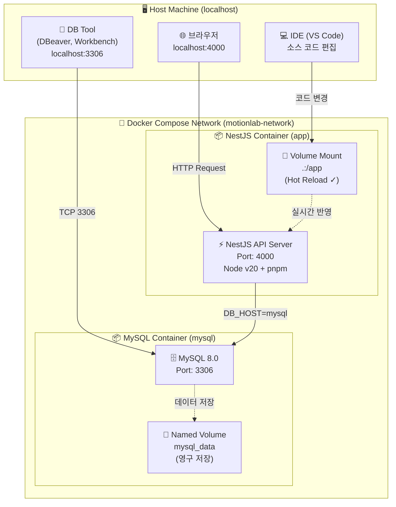
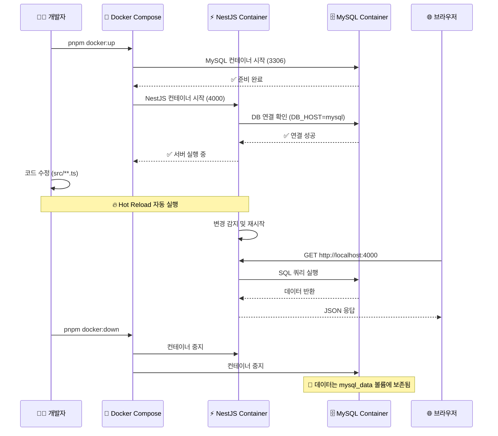
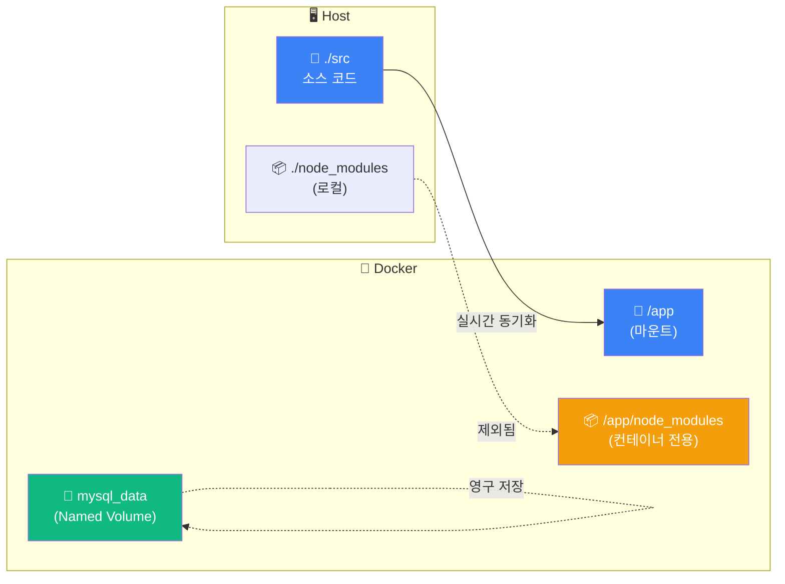
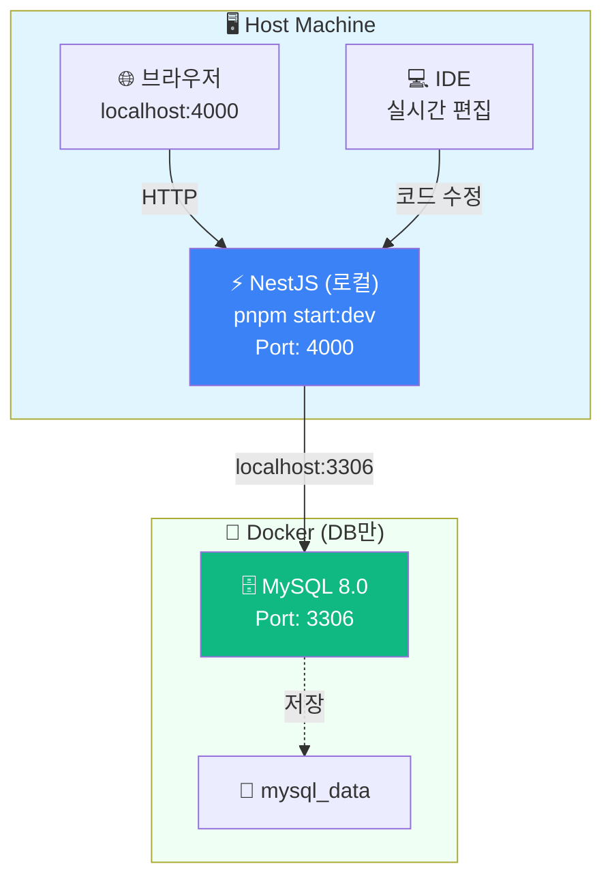

# 📘 MotionLab Server - 개발 환경 가이드

이 프로젝트는 **NestJS(API)**와 **MySQL(DB)**을 Docker Compose로 관리합니다.
복잡한 설정 없이 **NPM 스크립트 명령어 하나**로 개발 환경을 구축할 수 있도록 설계되었습니다.

## ✅ 사전 요구사항 (Prerequisites)

이 프로젝트를 실행하기 위해 아래 도구가 설치되어 있어야 합니다.

- **Docker Desktop** (필수)
- **Node.js v20+** (로컬 개발 시 권장)
- **pnpm** (`npm install -g pnpm`)

---

## 1️⃣ 아키텍처 및 동작 원리

### 🏗️ 전체 구조



---

### 📊 동작 흐름



---

### 🔑 핵심 포인트

### **Host (내 컴퓨터)**

- `http://localhost:4000` → NestJS API 접속
- `localhost:3306` → MySQL 직접 접속 (DB 툴 사용 가능)
- 소스 코드를 편집하면 컨테이너에 실시간 반영

### **NestJS 컨테이너 (app)**

- 코드 변경 시 **Hot Reload** 자동 작동 (볼륨 마운트: `.:/app`)
- **Node v20** 사용으로 `crypto` 이슈 방지
- 내부 통신 시 `localhost`가 아닌 **`mysql`** (서비스명) 사용
- 환경 변수 `DB_HOST=mysql`로 자동 설정

### **MySQL 컨테이너 (mysql)**

- 데이터는 `mysql_data` 볼륨에 영구 저장
- 컨테이너를 내려도 데이터 유지
- UTF-8 문자셋 및 `mysql_native_password` 인증 방식 사용

### **네트워크 (motionlab-network)**

- Bridge 네트워크로 컨테이너 간 통신
- 서비스명(`mysql`, `app`)으로 DNS 자동 해석

---

### 📁 볼륨 구조



**볼륨 마운트 전략:**

- `.:/app` → 소스 코드 실시간 반영 (Hot Reload)
- `/app/node_modules` → 컨테이너 내부 모듈 보존 (로컬 충돌 방지)
- `mysql_data` → DB 데이터 영구 저장

---

## 2️⃣ 핵심 파일 구성

### 📂 디렉토리 구조

루트 디렉토리를 깔끔하게 유지하기 위해 환경 변수는 `environments/` 폴더에서 관리합니다.

```
motionlab-server/
├── environments/
│   ├── .env.example       # (Git 공유) 환경 변수 템플릿
│   └── .env.local         # (Git 무시) 실제 내 로컬 설정값
├── src/                   # 소스 코드
├── Dockerfile.dev         # 개발용 Docker 이미지 설정
├── docker-compose.yml     # 컨테이너 오케스트레이션 설정
└── package.json           # 실행 스크립트 포함

```

---

### 🐳 docker-compose.yml

`environments/.env.local` 파일을 읽도록 설정되어 있으며, 코드와 DB 연결을 위해 핵심 변수(`NODE_ENV`, `DB_HOST`, `PORT`)를 **강제로 덮어씌워 에러를 방지**합니다.

- 👉 설정 파일 내용 보기 (클릭)

  ```yaml
  version: '3.8'

  services:
    # [App] NestJS API Server
    app:
      build:
        context: .
        dockerfile: Dockerfile.dev
      container_name: motionlab-api
      ports:
        - '4000:4000' # Host Port : Container Port
      volumes:
        - .:/app # Hot Reload를 위한 소스 마운트
        - /app/node_modules # 컨테이너 내부 모듈 보존
      env_file:
        - ./environments/.env.local
      environment:
        - NODE_ENV=local # 코드 검증 통과용 (강제 주입)
        - PORT=4000 # 내부 포트 명시
        - DB_HOST=mysql # Docker 내부 통신용 (localhost 아님!)
      depends_on:
        - mysql
      networks:
        - motionlab-network
      restart: unless-stopped

    # [DB] MySQL 8.0
    mysql:
      image: mysql:8.0
      container_name: motionlab-mysql
      ports:
        - '3306:3306'
      env_file:
        - ./environments/.env.local
      environment:
        # .env.local 파일에서 값을 읽어옴
        MYSQL_ROOT_PASSWORD: ${DB_PASSWORD}
        MYSQL_DATABASE: ${DB_DATABASE}
      volumes:
        - mysql_data:/var/lib/mysql
      networks:
        - motionlab-network
      command: --default-authentication-plugin=mysql_native_password

  volumes:
    mysql_data:
      driver: local

  networks:
    motionlab-network:
      driver: bridge
  ```

---

### 📄 Dockerfile.dev

`crypto` 에러 방지를 위해 반드시 **Node 20 이상**을 사용하며, 패키지 매니저로 `pnpm`을 사용합니다.

- 👉 설정 파일 내용 보기 (클릭)

  ```docker
  FROM node:20-alpine

  WORKDIR /app

  # pnpm 설치 및 패키지 파일 복사
  RUN npm install -g pnpm
   package.json pnpm-lock.yaml ./

  # 의존성 설치 (Lockfile 기준)
  RUN pnpm install --frozen-lockfile

  # 소스 코드는 docker-compose의 volume으로 마운트하므로  불필요
  # 하지만 빌드 컨텍스트 명시를 위해 남겨둠
   . .

  CMD ["pnpm", "start:dev"]

  ```

---

## 3️⃣ 빠른 시작 가이드

새로 프로젝트를 클론 받은 팀원은 아래 **4단계**만 따라 하세요.

### Step 1. 환경 변수 파일 생성

`environments` 폴더에 있는 예제 파일을 복사하여 로컬 설정을 만듭니다.

```bash
cp environments/.env.example environments/.env.local
```

> ⚠️ 주의: .env.local 파일 내부의 DB_PASSWORD, JWT_SECRET 등을 본인 로컬 환경에 맞게 수정하세요.
>
> `PORT`는 `4000`으로 설정되어 있는지 확인하세요.

**필수 수정 항목:**

```
# environments/.env.local
NODE_ENV=local
PORT=4000
DB_HOST=localhost        # 하이브리드 모드용 (기본값)
DB_PORT=3306
DB_USERNAME=root
DB_PASSWORD=changeme     # ⚠️ 본인 비밀번호로 변경
DB_DATABASE=motionlab
DB_SYNCHRONIZE=true

JWT_SECRET=changeme      # ⚠️ 32자 이상 랜덤 문자열
JWT_EXPIRES_IN=1d
JWT_REFRESH_SECRET=changeme  # ⚠️ 32자 이상 랜덤 문자열
JWT_REFRESH_EXPIRES_IN=7d

```

---

### Step 2. 로컬 의존성 설치

IDE(VS Code 등)의 자동 완성을 위해 로컬에도 패키지를 설치합니다.

```bash
pnpm install

```

---

### Step 3. Docker 실행 ⭐

매번 긴 명령어를 칠 필요 없이, `package.json`에 정의된 단축 스크립트를 사용합니다.

**실행 명령어:**

```bash
pnpm docker:up

```

---

### Step 4. 로그 확인 및 접속

서버가 잘 떴는지 확인합니다.

```bash
# 전체 로그 실시간 확인
pnpm docker:logs

# app 서비스만 확인 (직접 명령어)
docker compose logs app

# mysql 서비스만 확인 (직접 명령어)
docker compose logs mysql

```

**접속 확인:**

```bash
# API 헬스 체크
curl http://localhost:4000

# Swagger 문서 (브라우저)
open http://localhost:4000/api

```

---

## 4️⃣ 주요 명령어

### 📦 NPM 스크립트 (권장)

| 명령어                | 설명                             | 사용 빈도  |
| --------------------- | -------------------------------- | ---------- |
| `pnpm docker:up`      | 컨테이너 시작 (백그라운드)       | ⭐⭐⭐⭐⭐ |
| `pnpm docker:down`    | 컨테이너 중지 및 제거            | ⭐⭐⭐⭐   |
| `pnpm docker:logs`    | 실시간 로그 확인 (Ctrl+C로 종료) | ⭐⭐⭐⭐⭐ |
| `pnpm docker:restart` | 컨테이너 재시작                  | ⭐⭐⭐     |
| `pnpm docker:build`   | 이미지 재빌드 후 시작            | ⭐⭐       |
| `pnpm db:up`          | MySQL만 실행 (하이브리드 모드)   | ⭐⭐⭐     |

**package.json 스크립트 설정:**

```json
{
  "scripts": {
    "docker:up": "docker compose --env-file environments/.env.local up -d",
    "docker:down": "docker compose --env-file environments/.env.local down",
    "docker:logs": "docker compose --env-file environments/.env.local logs -f",
    "docker:restart": "docker compose --env-file environments/.env.local restart",
    "docker:build": "docker compose --env-file environments/.env.local up -d --build",
    "db:up": "docker compose --env-file environments/.env.local up -d mysql"
  }
}
```

---

### 🔧 직접 Docker 명령어 사용 (고급)

NPM 스크립트 없이 직접 실행하고 싶다면:

```bash
# 시작
docker compose --env-file environments/.env.local up -d

# 중지
docker compose --env-file environments/.env.local down

# 로그 (전체)
docker compose --env-file environments/.env.local logs -f

# 로그 (특정 서비스만)
docker compose logs app
docker compose logs mysql

# 재시작
docker compose --env-file environments/.env.local restart

# 재빌드
docker compose --env-file environments/.env.local up -d --build

# 컨테이너 상태 확인
docker compose ps

# 완전 초기화 ⚠️ DB 데이터 삭제됨
docker compose --env-file environments/.env.local down -v --rmi all
docker builder prune -f

```

---

## 5️⃣ 하이브리드 모드 (리소스 절약)

Docker가 너무 무겁거나(Mac 발열 등), 빠른 개발이 필요할 때는 **API 서버는 로컬에서 실행하고, DB만 Docker로** 띄우는 방식을 추천합니다.

### 🔄 하이브리드 아키텍처



### 장점

- ✅ 컨테이너 리소스 사용 최소화 (DB만 실행)
- ✅ Hot Reload 속도 향상 (로컬 Node.js가 더 빠름)
- ✅ IDE 디버깅 도구 사용 가능

### 실행 방법

### Step 1. 데이터 백업 (필요 시)

docker compose down 명령어는 데이터를 유지하지만, 만약 -v 옵션을 붙여 초기화할 계획이라면 미리 데이터를 백업해야 합니다.

```dockerfile
(선택) 현재 실행 중인 DB 데이터 덤프
docker exec motionlab-mysql mysqldump -u root -p${DB_PASSWORD} motionlab > backup.sql
```

### Step 2. 기존 컨테이너 정리

실행 중인 모든 컨테이너(App + DB)를 종료합니다.

```
pnpm docker:down
```

### Step 3. init.sql 적용 확인

docker-compose.yml에 DB 초기화 스크립트가 잘 연결되어 있는지 확인합니다. (최초 실행 시 테이블 자동 생성용)

```dockerfile
  # docker-compose.yml 예시
volumes:
- mysql_data:/var/lib/mysql
- ./init.sql:/docker-entrypoint-initdb.d/init.sql  # 👈 이 부분이 있는지 확인
```

### Step 4. DB만 실행 (Hybrid Mode 시작)

이제 DB 컨테이너만 백그라운드로 실행합니다.

```dockerfile
pnpm db:up
```

Step 5. 로컬 앱 실행
이제 로컬에서 NestJS 서버를 실행합니다.

```dockerfile
pnpm start:dev
```

### 💡 주의사항

**init.sql**을 수정했다면, 반영을 위해 DB 볼륨을 초기화해야 할 수 있습니다.

이 경우 docker compose down -v로 볼륨을 삭제 후 다시 pnpm db:up을 하세요.

### ⚠️ 경고: 볼륨 삭제 시 모든 데이터가 삭제되므로 주의하세요!

```dockerfile
# 완전 초기화 (데이터 삭제)
docker compose down -v

# DB 재시작
pnpm db:up

# 앱 실행
pnpm start:dev
```

### ✅ 확인 방법

```dockerfile
# 1) DB 컨테이너 상태 확인
docker compose ps

# 2) 로컬 앱 접속 확인
curl http://localhost:4000

# 3) DB 연결 확인
docker compose exec mysql mysql -uroot -p${DB_PASSWORD} -e "SHOW DATABASES;"
```

---

## 6️⃣ 트러블슈팅

### ❌ 문제 1: `NODE_ENV must be one of the following values: development, production, test`

**원인:** `environments/.env.local`에 `NODE_ENV`가 없거나 잘못된 값입니다.

**해결:**

```bash
# environments/.env.local 파일 확인
cat environments/.env.local | grep NODE_ENV

# 올바른 값으로 수정 (local 또는 development)
NODE_ENV=local

```

---

### ❌ 문제 2: `Error: Cannot find module '@nestjs/core'`

**원인:** 로컬 `node_modules`와 Docker 컨테이너 간 의존성 불일치

**해결:**

```bash
# 1) 로컬 의존성 재설치
rm -rf node_modules pnpm-lock.yaml
pnpm install

# 2) Docker 이미지 재빌드
pnpm docker:build

# 3) 로그 확인
pnpm docker:logs

```

---

### ❌ 문제 3: `Port 4000 is already allocated`

**원인:** 이미 다른 프로세스가 4000 포트를 사용 중입니다.

**해결:**

```bash
# 1) 포트 사용 중인 프로세스 확인
lsof -i :4000

# 2) 프로세스 종료
kill -9 <PID>

# 3) 또는 docker-compose.yml에서 포트 변경
# ports:
#   - "4001:4000"  # Host Port를 4001로 변경

```

---

### ❌ 문제 4: `ReferenceError: crypto is not defined`

**원인:** Node.js 버전이 18 이하이거나, `@nestjs/typeorm` 버전 이슈

**해결:**

```bash
# Dockerfile.dev 확인
cat Dockerfile.dev | grep FROM
# 출력: FROM node:20-alpine  ← Node 20 이상이어야 함

# TypeORM 버전 다운그레이드 (필요시)
pnpm add @nestjs/typeorm@10.0.2

# 재빌드
pnpm docker:build

```

---

### ❌ 문제 5: MySQL 접속 불가

**원인:** MySQL 컨테이너가 완전히 초기화되기 전에 앱이 실행됨

**해결:**

```bash
# 1) MySQL 로그 확인
docker compose logs mysql

# 2) 완전히 초기화될 때까지 대기 (약 30초)
# 아래 메시지가 보이면 준비 완료:
# [Server] /usr/sbin/mysqld: ready for connections

# 3) 앱 재시작
pnpm docker:restart

```

---

### 🔍 일반적인 디버깅 명령어

```bash
# 컨테이너 상태 확인
docker compose ps

# 특정 컨테이너 로그 확인
docker compose logs app
docker compose logs mysql

# 컨테이너 내부 접속
docker compose exec app sh
docker compose exec mysql bash

# 환경 변수 확인 (컨테이너 내부)
docker compose exec app env | grep DB_

# MySQL 접속 확인
docker compose exec mysql mysql -uroot -p${DB_PASSWORD} -e "SHOW DATABASES;"
```
